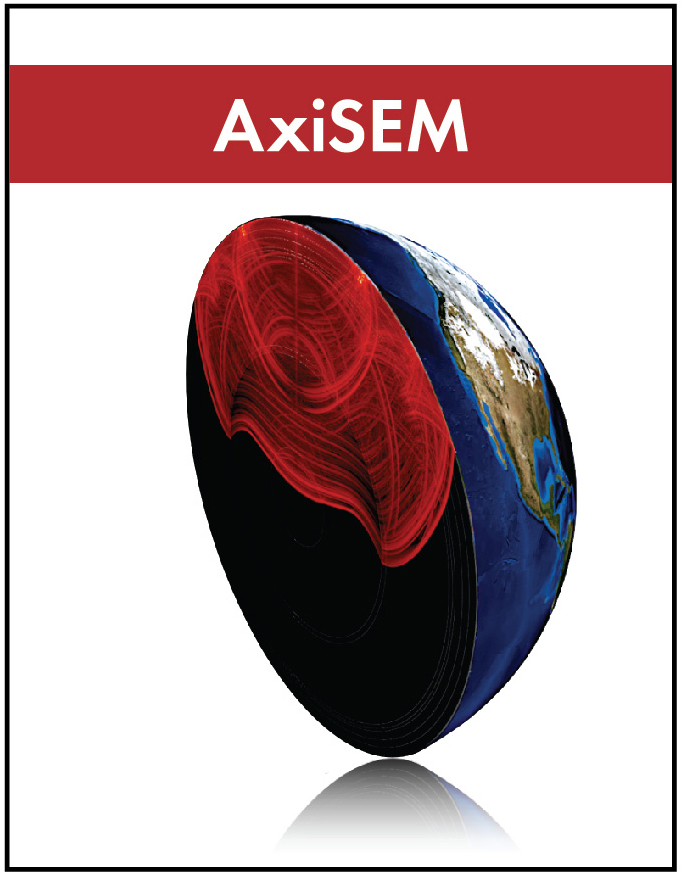

# AxiSEM3D
Welcome to the wonderful world of AxiSEM3D, a flexible, high-performance computational method for solving the elastodynamic wave equation in three-dimensional, heterogeneous media. It has been used in seismology for the Earth, the Sun, the Moon, and many of other rocky planets and moons of the Solar System. 

In this manual, we will explore the practicalities of using this code, touching on the mathematical aspects as relevant to the casual user, the input and output files, and pre- and post-processing. 


## Table of Contents
```{toctree}
---
maxdepth: 1
---
intro.md
overview/index.md
methods/index.md
installation/index.md
user/index.md
developer/index.md
help/index.md
glossary.md
parameter/index.md
references.md
authors.md
```
