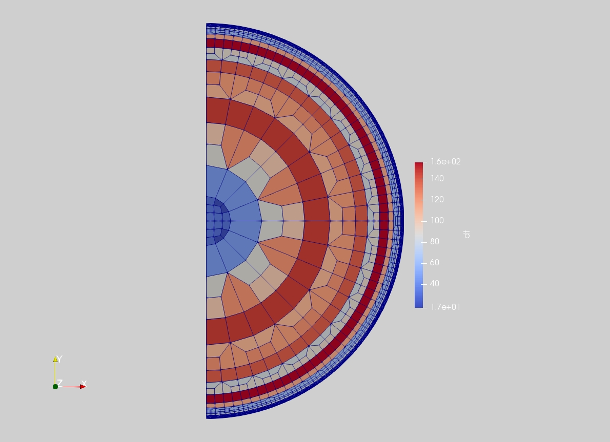
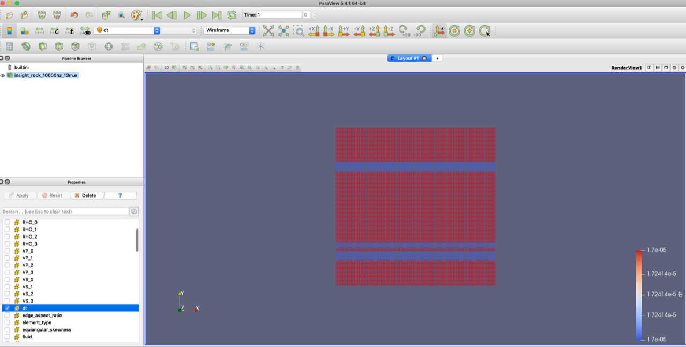

# Generating meshes

In general, generating the mesh is not time consuming. Higher-resolution (smaller period) meshes do take longer to generate though, so whilst you are learning, let's stick to periods of 50 seconds for efficiency. 

```bash
python -m salvus_mesh_lite.interface AxiSEM -h
```

or 

```bash
python -m salvus_mesh_lite.interface AxiSEMCartesian -h
```


Will give you all the options that your mesh can take. Most of these are not relevant to the casual user, but those that you will want to know about are below. Example usage is given in square brackets (discount the brackets themselves). 

* --output_filename : the name you want your mesh to have (my_mesh_50s.e)
* --basic.period : what it says on the tin! In seconds [ 50]
* --basic.model : the name of your .bm file (my_model.bm) or the full path (users/ben/mesh/my_model.bm). 
* --attenuation.frequencies: for most global-scale earth-like purposes, you don't need to change this. However, if you are running high-frequency simulations on small bodies (e.g. asteroids), and want attenuation, you need to change the attenuation bands. The default corner frequencies are 0.001 Hz and 1 Hz (1 second to 1000 seconds), but make sure your mesh frequency is well within this band. If you want to simulate at 100 Hz, obviously you will need to make these frequencies more suitable (10,1000). Alternatively, you can set `--attenuation.auto_band` to true and the code will work this out for you. 
* --spherical.min_radius : if you want to only simulate the upper layers of a planet, you can change the minimum radius. The default minimum radius is 0 (i.e you get the whole planet), but you can change this if you want - just make sure your column header is `RADIUS` if you do! 

For spherical meshes, you might also sometimes want to change: 


* --chunk2D.max_colatitude : if you only want to simulate a chunk of the planet, say 45 degrees, just reduce this from its default of 180. Note that this angle is the angle of the flat mesh that's included: a 45 degree mesh, when used in a simulation, will span 90 degrees of the surface (because the 2D mesh is effectively rotated about the source, which is at the north pole). 

For cartesian meshes, you'll also need to set: 

* --cartesian2Daxisem.x  : the horizontal dimensions of the mesh, in kilometres
* --cartesian2Daxisem.min_z : the 'depth' you want the mesh to go down to. The default is the deepest discontinuity in the model. The units will depend on the units you've used in your .bm file. 

Some things should not be altered: 

* --attenuation.number_of_linear_solids is a particularly important one: the default quadrature order in AxiSEM3D's solver (4) will only work if this is set to 5. 
* --spherical.ellipticity : AxiSEM3D can handle ellipticity, but it is not set here, rather in the inparam.model file. 
* --generate_plots : this is a very slow, inefficient and unhelpful way to use meshes. Use paraview instead. 

Here's an image of a spherical mesh, visualised using Paraview:

<div align="center">
 <br>
<br>
</div>

## Checking and debugging meshes

It's generally worth checking a mesh before using it, especially if it's going into an HPC queue where you can't run in interactive mode to check that it's been read in properly. As mentioned before, [Paraview](https://www.paraview.org) is the best tool to use. 

When you open your mesh in paraview, you should see a list of variables stored on the mesh. Some are global (e.g. radius), whilst others are local (e.g. timestep, dt). Select the ones you want to view, and click 'apply'. Then, in the drop-down menu in the overhead toolbar, select the variable you want to see (the default is likely to be something like 'vtkBlockColors'). Then, change representation from 'surface' to 'wireframe' or 'surface with edges'. You should then be able to see your mesh. 


** Here's a cartesian mesh, visualised using Paraview and showing the software interface. 
<div align="center">
<br>
</div>


A few things that are worth checking: 

* You have fluid regions where you expect to have them 
* That the minimum resolved period is about what you want it to be, and the timestep is reasonable (this can be hard to judge). 
* You can also check the size of the mesh by overlaying a solid of known size: go to 'Sources' in the uppermost option bar, and select 'disk' or 'box' where you can add an overlay to check sizing. 
* Be aware of ridiculously large aspect rations or skewnesses in your elements. AxiSEM3D can handle things pretty well, but if your elements are very deformed, you may run into stability issues. Very deformed would be an aspect ratio >> 1, for example. 

In addition to the errors we've already discussed, one common issue when dealing with strong velocity contrasts is for the mesh refinement to fail. You will get a warning from the mesher here, and you can fix it by changing the `--refinement' flags (you might need to play around to get it to work). 

You should bear in mind that just because a mesh is produced, it doesn't mean it will work (or be sensical). For example, if you get your columns in the wrong order in your .bm file, the mesher will happily produce a model with v_s > v_p, but this makes no physical sense and the code will be unstable. Of course, no one's ever done this before, or spent many months trying to find the error... 

## Using your mesh 

Once you've made your mesh and checked it, the next thing to do is to make sure that it's linked properly to the input files for AxiSEM3D. These are described later on, but just make sure youre consistent: file names need to match, if you have attenuation in your mesh, make sure it's also on in the solver input files, and so on. 
