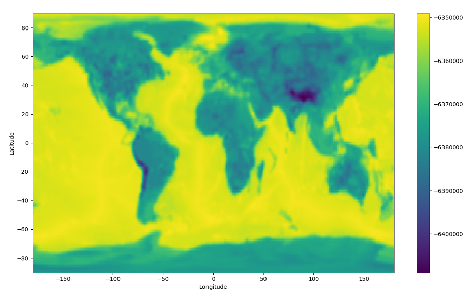
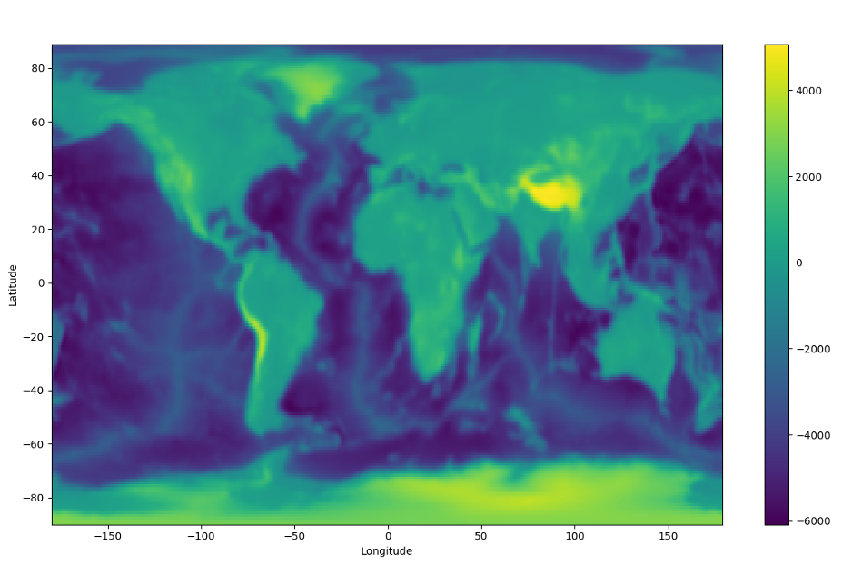

# Geometric Models

  Geometric models are those that take a specific boundary
(discontinuity), and deform/undulate it is no longer spherically
symmetric with respect to the planet’s centre. The discontinuities you
are most likely to undulate are probably the surface or seafloor, the
Moho, and the CMB; though in principle you can create a boundary
wherever you like and undulate it.

If you like, you can think of a geometric model as taking a 2D surface
embedded within the Earth and moving it inward out outward radially,
with the degree of stretching or shrinking depending on where on the
globe you are.

As such, the geometric model files are not too complicated, as they
consist of three coordinates: a series of latitude and longitude points
(together forming a geometric grid), and a third variable defining the
position of the boundary at each point on the grid. The third variable
is either a depth or a radius (which you use depends on the boundary:
radius may make more sense for the surface and depth for the Moho.

Crucially (and in both cases), the depth and radius are given with
respect to the boundary’s depth or radius in the 1D case. Note that the
undulations on a particular boundary are given as depth/radii with
respect to the boundary in question itself. This means that an
undulation of 1 km on either the Moho or the surface is given in your
model file as +1000 at that particular point, not 6372000, 6372, or
anything else. In the input files you set which interface this is in
reference to, e.g., 6371 km km radius (or 0 km depth) for the surface.
So if you are using PREM and have a Moho undulation dataset where the
Moho’s point at each point on the sphere is expressed as a depth below
the surface, you probably need to subtract 24.4 km from it, because that
is the PREM Moho depth.

As an illustrative but pointless example, if you created a 3D geometric
model file for the Earth’s surface but wanted the surface to be totally
flat, you would have a series of latitude and longitude points (−90° to
90° and −180° to 180°) respectively, and the third variable would be
an array of zeros (meaning no change in either direction from the
surface position in the 1D case). If you were doing the same for the
Moho, the array would be completely identical (all zeroes in the third
variable) – it would be in the input file that you specify which
boundary you are deforming.

Obviously the number of depth/radius points in your 3D model must match
the number of latitude/longitude gridpoints you have. If you sample
latitude and longitude each at a spacing of 1°, that gives you 180 ×
360 gridpoints, each of which must have a value for the surface
elevation or depth. You can choose the spacing that you want: 1° is
probably fine for most things.

## Creating new geometric models

The base structure for global scale, 3D geometric models is included in
[Ben’s AxiSEM3D GitHub repository](https://github.com/benjaminfernando/axisem3d-3dmodels/tree/main). In short we have created two python files (`etop01.py` and `moho.py`) which
can be used to create and edit topographic surface and moho geometric
models.

<b>*** TO DO: we should move it to the main one. </b> 

The python scripts available in the GitHub repository are able to write
your Moho and topographic models to a format that will be read by
AxiSEM3D. We assume some familiarity with python and that you are able
to run the functions given and are aware of how they pass outputs to one
another using return.

You are not obliged to use these scripts by any means, but they are
designed such that the file structures, variable names, and sampling all
match the template input files provided. If you have your own model
which is in a similar gridded format and you want to convert it into
something you can use, you should just be able to read in the filenames
and use the same functions in the python scripts to write the output. It
is always worth re-reading in a new model that you have created and then
plotting it to make sure that it is doing what you think it is doing.

**Crust 1.0 Moho:**

* The Crust 1.0 Moho is sampled at 1° intervals and generally you will not need
  to resample this as the frequency changes. Certainly you cannot get to
  anything less than 1 ° resolution, as this is as good as the data
  gets!
*  Some of the strongest gradients in Crust 1.0’s Moho are at the western
  edge of South America. Obviously this is not simply a coincidence -
  there is a good physical reason for it! Unfortunately, it does mean
  that the Moho and the seafloor/Earth’s surface end up being quite
  close to each other. This both shrinks elements (making timesteps
  small, and cost expensive), and risks the boundaries interpolating
  into each other (which stops the interfaces being conformal, and
  breaks the code).  

 

    
<em>Crust 1.0 Moho undulation as a function of latitude and
longitude. This plot shows the model with ° smoothing, sampled at 1°.
For more details on the radial coordinates used, see below. Note that
even with 1° smoothing, there are still strong gradients in Moho depth
off the west coast of South America. We suspect that this area (or
somewhere like it elsewhere in the world) is the cause of many issues.</em>  

**ETOP01:**

- ETOP01 is a global topographic/bathymetric model
  that is sampled at 1-arcminute resolution.

- 1 minute sampling is very much overkill for most projects, and is not
  feasible due to the amount of memory to store a model of this size. It
  should be downsampled to something more like 1 degree. If you want a
  more accurate determinant of how to downsample it, you can calculate
  the minimum resolved seismic wavelength at a particular period, and
  use a sampling which is at least as fine as this. Remember that as the
  period of the simulations you are running decreases (i.e., as the
  frequency increases), the waves become sensitive to smaller and
  smaller spatial structures, so you can get away with less
  downsampling.

- The strongest gradients in ETOP01 (by quite some margin) are also off
  the west coast of South America, where the Andes meet the coast and
  the subduction trench. We’ll come back to the errors that this can
  cause later, but you can get around some of it by applying some
  smoothing.

 

 
<em>ETOP01, sampled at 1° and smoothed using a 1° sigma
Gaussian. Again, note that the strongest gradients in topography are at
the same locations as the strongest gradients in Moho undulation, i.e.
at the western edge of South America. </em>  

## Crust 1.0 Moho
Let us start with the Crust 1.0 Moho
script because it is somewhat
simpler to understand. The script is called `moho.py` and takes as
input a grid file (.xyz) called `depthtomoho.xyz` which is a list of
latitudes, longitudes, and moho depths at each pair therein.

The first function,`load_moho_dat`, takes the input file and uses a
series of numpy functions to split it, for simplicity we have only
actually kept the 3rd column (\[<!-- -->2\] in python) which is the
depths, and re-created the latitude and longitude from scratch. Make
sure that the coordinates are sorted in ascending order (-90° to 90°,
-180° to 180°) or else the code will not like it.

The second function, write_data_to_netcdf_file, writes the inputs of the
above function to a netcdf file. If you have not come across netcdf
files before it is worth looking them up, they are basically a highly
efficient way of storing data. Unlike ASCII files you don’t need to
worry about pairing up the points correctly, within each file is a
header called `latitude` (similarly for the other variables) which
contains the points you have created.

There are a few stages to writing your new model file into netcdf
format. First you need to create the file using Dataset (a method in the
python netcdf4 module), and then create the three dimensions. You can
specify the length of each dimension (latitude being 180 points,
longitude being 360), or set this to 0 to allow them to grow as needed.

Then, you need to create the variable spaces to go with the dimensions
you have created, and specify that the values will be floating point
numbers (`d`). Finally, you add the actual points into the variable
fields. Make sure that the units match, add corrections for metres to
kilometres or vice versa if needed.

Note that if at any point you get errors about not being able to open a
file, that is probably because it is already open. You just need to
close it before opening it again.

Finally, r`ead_data_from_netcdf_file` allows you to just reload, and if
you want to, plot (`set plot=True`) the saved netcdf file to check that
it looks like what you think it should look like.

## ETOP01

Using the ETOP01 script is slightly more complicated than using the Moho
one, because you need to downsample (and possibly also average or
smooth) the topography from the raw file that you download for the
reasons that we already discussed.

The functions in `etop01.py` are similar to those in `moho.py` but
with a few of additions. When you read in the raw model, there are two
things that you can do to it:

- Average: average across n datapoints to produce a new topographic
  model.

- Filter: smooth the gradients in the new topographic model out using a
  gaussian filter.

If this seems confusing, consider that **average** basically means that
you take a set of n by n points in the original 1-arcminute resolution
model and represent their average as a single point in your new
topographic model that AxiSEM3D is going to use. Choosing how big n is
allows you to choose how fine your new model is (larger n = coarser
model because a larger area is being represented by a single new
elevation point). Once you have your new model you can further smooth
the gradients in it by applying a 2D filter (like a blurring filter on
Instagram).

The default sampling that we have chosen for the new 3D model is 1°, to
match what is used for the Moho. If you want to change this it is
relatively straightforward, just edit the relevant functions in
`etop01.py`.

Rather than just simply choosing the midpoint of every 1×<!-- -->1°
cell you instead take the arithmetic mean of each 1×<!-- -->1 arcminute
cell within it to create your new elevation point (method 1).
This naturally averages out extremes in your new model, and makes it
less likely that the Jacobian will be badly behaved. We can get this to
work for around 10s period global runs, but not 5s. This is probably
because some of the gradients are still too large to be stably
interpolated by AxiSEM3D. The issue is likely off the coast of South
America, where a trench and an altiplano are found in close proximity.
If you are doing regional-scale runs away from this area that might
solve the issue, but in the more general case, you need to use a
**filter** (method 2).

Starting with method  – an average across each 1×<!-- -->1° degree cell –
the copy of ETOP01 provided in these files is then filtered using method 1 a
2D 1° degree standard deviation Gaussian
In effect, this treats the output array from the averaging as an image
and applies a slight blurring filter; or technically a 2D convolution
with a Gaussian kernel.

This simply smooths out some of the largest gradients in averaged array.
You can choose how much smoothing happens by changing the value of
`sigma` in `filter_data`. The default is 1°, reducing this toward zero
makes the Gaussian kernel steeper and narrower and reduces the degree of
blurring (in the limit of a zero standard deviation, the original image
is returned). Similarly if you still get an error, you can increase the
standard deviation which smooths out even more of the gradients. Note
that you do not need to pass the units of `sigma` to the code, it does
this in terms of sampling points (i.e., *1* ends up being 1  because
there are 180 × 360 points, i.e. one per degree). If you do edit the
python script to change the sampling, make sure the units of sigma are
also changed to match.

Note that there are potentially some issues associated with switching
from grid-centred to cell-centred systems at the poles – see the
`moho.py` file for some comments on this topic.

> **Note on Efficiency.**  
> Two aspects go into optimising a geometric model for efficiency:
> 1. The smaller the undulation range is, the smaller the "squashed" elements inside the undulation range become. This lowers the required time-step for undulated region in equal measure. And, unless there is a part of the medium requiring even smaller time steps, this makes the run more expensive.
> 2. When using ACA optimisation (see section on Nr field), undulated ranges require higher azimuthal resolution. So, from an ACA perspective, it would be ideal to keep the ranges as small as possible.
>
> For most 3D geometric models there is hence an optimally efficient size for the undulation range. It is by no means necessary to find this exact range to perform an efficient simulation, but it is worth keeping in mind that there are two competing effects at play.
