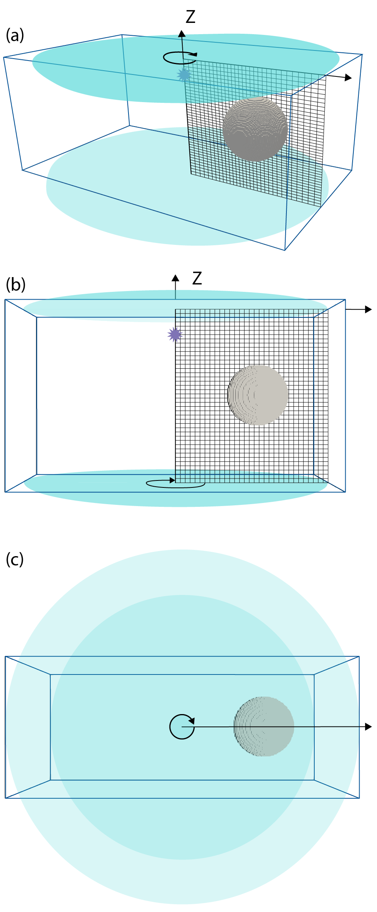
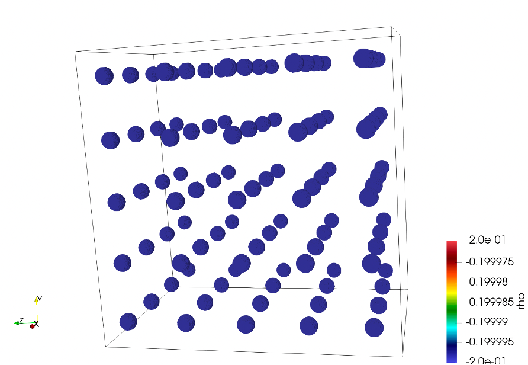
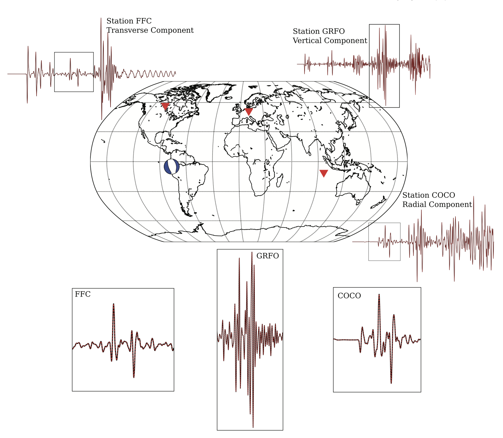

# Volumetric Models

Volumetric models are those which change the seismic properties of mesh
elements not at interfaces: for example, decreasing Vs in a particular
region to represent a region of partial melt.

In AxiSEM3D, you can alter multiple parameters at any point in the mesh,
for example Vp, Vs, density, or the elastic tensor *C*<sub>*i**j*</sub>.
The volumetric models are like the geometric ones in structure, but
rather than there being two spatial dimensions there are three
(latitude, longitude, and radius/depth).

Volumetric models require the production of a netcdf dataset file (.nc)
which can be done using your favourite coding language such as MATLAB or
Python. It is important to remember that these two languages save
multidimensional arrays in column-major and row-major formats
respectively, by default, but more on that later. If you are unfamiliar
with netcdf files we would recommend reading this [article](https://towardsdatascience.com/create-netcdf-files-with-python-1d86829127dd).
<br>

<div align="center">
<br>
<em>Mesh rotating (green arrow) around a source-centred (source:
violet star) axis to incorporate 3D perturbation. Side (a, b) and top
(c) views are shown. The 3D input model is the cuboid marked by blue
lines. This model a 0 valued perturbation except in the sphere region
which is displayed. The mesh is rotated about its source-centred axis to
produce a cylinder. Any part of this 3D input model that is within the
cylinder (teal) is sampled and incorporated into the mesh values used by
the solver. </em><br><br>
</div>


AxiSEM3D incorporates 3D models by rotating the 1D mesh around its axis,
forming a cylinder (or sphere if using a D-shaped mesh). Any parts of
the 3D model that are within that cylinder will then be incorporated
into the overall 3D model that AxiSEM3D uses
shows a mesh rotating around a source-centred axis. The 3D input model
is shown by a blue cuboid. Any part of this input model that is within
the teal cylinder is sampled. So, how do we create this 3D model shown
in the blue box?

The netcdf file holding the 3D model needs to contain multiple
variables, which can contain information about, for example, x, y, z (or
equivalently, depth); Vp, Vs, density, or the elastic tensor
*C*<sub>*ij*</sub> – though you do not need to change all of these
from the 1D values if you do not want to.

Note that the names of these variables within the .nc file do not
matter. This is because you will specify what you have named them using
the variables *nc_variables* (for x, y, z) and the variable factor for
each of the properties, for example *VP*, *VS*, and *RHO*. As long as
the names are consistent, then all is good!

The .nc file will also need to have three dimensions. These need to be
the dimension of the x, y and z array variables, i.e. the variable has a
defined and specific value at each point in the grid. Each of the
location variables x, y, and z (or depth) have a single dimension. Each
of the parameter variables, for example *VP*, *VS*, and *RHO*, will have
three dimensions (corresponding to the dimensions x, y, z). To see this
in action, you can load the .nc file provided in Example 3 (see template
folders in main AxiSEM3D GitHub), and load it into python using:

```
import netcdf4 as nc  
data = nc.Dataset(“path/to/file/SEG_C3_SOLID.nc”)  
print(data)
```

In doing this, you will see the 6 variables in which x, y, and depth are
1D; while *VP*, *VS*, and *RHO* are 3D. The x, y, z variables are simply
an array of coordinates for the limits of your model, e.g., with x going
from −5062.5 km to +5062.5 km with 676 elements. You can make these
using a normal linspace function. To print the actual data values of a
variable “x” held in the dataset called “data” you can use:

```
print(data\[“x”\]\[:\])
```

Equivalently, the *VP*, *VS*, and *RHO* variables hold a 3D array (e.g.,
a numpy array) with corresponding values at each of those coordinate
points in x, y, z space.

## Creating new volumetric models 

The example directory `04_simple_3d_shapes` contains a number of
python files for producing 3D models. You can inject shapes such as
spheres (technically known as blobs), cylinders, ellipsoids and cuboids
at certain points, so that your 3D model may look like
on of the models below. In addition to the relevant
python source code to generate such 3D models, an interactive python
notebook (`Example_4_README.ipynb`) can guide you through two
examples: one for a cartesian mesh, and one for a spherical (D-shaped)
mesh. Even if such simple shapes are of no interest/use it may be worth
checking out the `writeNetCDF` function within `model.py`, which
demonstrates how to generate a netCDF file in python from NumPy arrays.

<div align="center">
<br>
<em>Example volumetric model containing spheres. </em><br><br>
</div>

Additionally, to create volumetric models that include seismic
anisotropy, scripts exist in the `05_anisotropy_global` example folder
in the AxiSEM3D GitHub page. AxiSEM3D is capable of calculating
synthetics for input models that include arbitrary anisotropy, described
by the the full elastic tensor *C*<sub>*ij*</sub>. Example papers that
do this are Tesoniero et al. (2020) and  Wolf et al. (2022b,, 2023a).

To start using seismically anisotropic volumetric models, we suggest
repeating the exercise from Tesoniero et al. (2020) who calculated seismograms for anisotropic
PREM in two different ways:

- For a “prem_ani” mesh. (Approach 1)

- For a “prem_iso” mesh, plus a volumetric 3D model specifying radial
  anisotropy between 220 and 24.4 km depth using the full elastic tensor
  to describe the seismic anisotropy. (Approach 2)

Examples for this exercise are provided in the `05_anisotropy_global`
folder, including scripts to create the volumetric input model.

<div align="center">
<br>
<em>Results for the test from Tesoniero et al. (2020). The identical red and black seismograms
are calculated using two different approaches (see text) </span></em><br><br>
</div>

Approach 2 requires the calculation of the full elastic tensor from the
vertical transverse isotropy of PREM in a depth range between 220 and
24.4 km. This is possible via the so-called Love parameters A, C, L, N
and F (see `prem_ani_Cijkl.m` file in
`PREM_anisotropy_w_and_wo_full_Cij_50s/processing`).

The PREM-test mentioned above is simple because the vertically isotropic
geometry of the anisotropy implies that the rotation of the elastic
tensor around the vertical (or radius) axis does not matter. In general
though, if more complicated seismic anisotropy is implemented into the
input model, this orientation will be crucial. In AxiSEM3D seismic
anisotropy is implemented such that the one of the horizontal axes of
the elastic tensor (specifically, x-axis in MSAT, Walker and Wookey, 2012) is aligned with
the north direction. To explore this, it is useful to implement a
horizontally transversely isotropic elastic tensor into an input model,
for example by rotating the PREM-anisotropy by 90 °. For this case the
effects of the rotation of the elastic tensor around the vertical
(radius, z) axis can be investigated. Please note that the way that
elastic tensor is implemented in AxiSEM3D means that, if you are close
to the pole, you have to be careful about whether you would like your
seismic anisotropy to change as a function of longitude (which it does
by construction) or not. If you would like to have your anisotropy not
change, you can just rotate by the longitude value.

## Values used in 3D arrays 

The actual values that you use in your 3D arrays can be used by axis in
a number of ways:

- Absolute values - the value in .nc is what is used by axis;

- Ref 1D – a perturbation relative to the 1D model (e.g., 0.2 is 20%)

- Ref 3D – perturbation relative to the 3D model;

- Ref_perturb - perturbation relative to the current perturbation at
  that point.

Most of the variables in the inparam.model.yaml file are quite self
explanatory for the 3D case. The ones to draw attention to are:
`data_rank` – this is where you need to be careful in respect to python
vs Matlab, and tell AxiSEM3D what order your coordinates are in;
`c_variables` – tells AxiSEM3D the name of x, y and z variables that
you used in the .nc file – e.g., this could be ‘X’, or ‘x’, or ‘x_arr’
etc...
