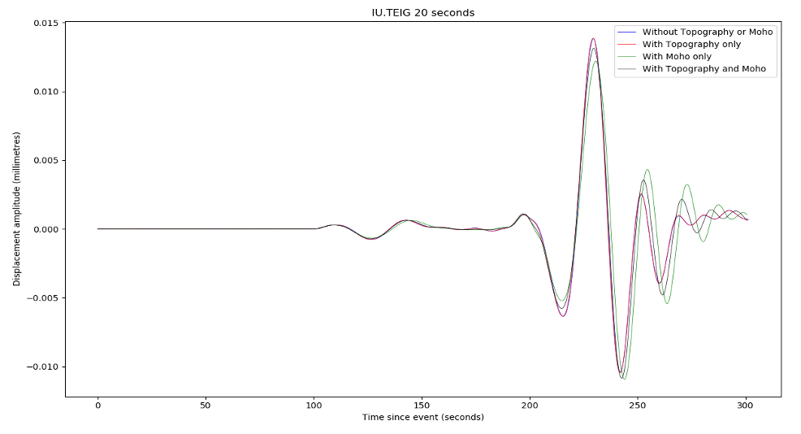

# Plotting Seismograms 

Once you have created a *Trace* object, plotting the seismogram is
trivial. You can either use the built-in method that `Trace` objects
have, but we prefer to use `matplotlib.pyplot` as you get much more
functionality and user-control.

To do this, inside the `plt.plot` command you just reference the Trace’s
time points and data points separately, using `trace.times()` and
`trace.data`. Note that the data points are not called (i.e., no
parentheses) but the time points are.

You can edit the figures using the same functionality you would for any
other matplotlib plot, for example by setting labels, axes, linestyles,
etc. You can also write relatively simple routines for doing things like
plotting record sections (codes not included for simplicity – email us
if you want them).

<em>Example seismograms. Note that the Moho undulations had to
be smoothed to 10% of their original amplitude to make this run work,
but some differences are still appreciable. </em>

## Filtering and convolution 

If you used a delta function source, you need to either filter or
convolve the Green’s function to return a result that is free of ‘noise’
at above the mesh frequency. It is worth thinking about the subtle
differences between *ObsPy’s filter* routines and *SciPy’s convolve*
ones.

In the broadest sense, these are of course identical, as filtering is
equivalent to a multiplication with a kernel in the frequency domain, as
is convolution. However, the way in which these are implemented can
vary, and you also need to think about how convolution ends up being
more complex in a numerical sense (with finite windows) than it is in
the simplest, infinite-domain analytical sense.

## Butterworth bandpass filters 

The simplest kind of filter that you might want to use is a
Butterworth-bandpass filter, whose functionality is included in ObsPy at
`obspy.signal.filter.bandpass` This is as close to a ‘rectangular’
filter as you will want to get, for technical reasons simply removing
all frequencies not between your two limits tends to give you numerical
artefacts. A Butterworth-bandpass filter has steep, but not vertical
sides. You can also choose the filter order (*corners*), and need to
specify (default four) corner frequencies. In certain cases we have also
found that running the filter both ways across the data
(`zerophase=True`) can help.

For synthetic data, which effectively contain no noise other than that
above the mesh period, the Butterworth-bandpass filter is a good choice.
You can cut out the high-frequency noise by simply setting *freqmax* to
the inverse of the mesh period, and you can remove low-frequency energy
below 100 s by setting *freqmin* to *0.01*. This is worth doing because,
strictly speaking, frequencies below 100 s (i.e. 0.01 Hz) are not
simulated properly in AxiSEM3D because we have no ellipticity, rotation,
or gravity.

If you were using actual data, with a non-white noise content, another
filter might be more appropriate: for example a *log-gabor* filter,
which does not come installed in ObsPy (We can also send it to you
though).

## Convolution with a Gaussian function 

Convolution with a Gaussian using SciPy ends up being a bit more
challenging than you might think – on a qualitative level, it is just
equivalent to swapping the frequency-domain representation of the
Butterworth-bandpass filter for the frequency-domain representation of a
Gaussian, which is also conveniently another Gaussian.

However, if you use `scipy.signal.convolve`, you need to make sure that
the convolution parameters of the Gaussian (or indeed whatever other
source-time function with appropriate frequency content you might wish
to use) are set correctly. This includes matching the *sampling rates*
(you can use ObsPy’s *Lanczos interpolation* to do this), and ensuring
that the convolution mode is set to *valid* – to avoid padding out the
seismogram with fake data points at either end.

## Other operations and commutativity

In an analytical sense, all these operations should commute and it
should not matter which order you do them in. In a numerical sense, this
does not always appear to be the case (though this may just be due to
poor processing on our part). So if something does not look right, try
playing around with the order of operations.

We have also found that applying a *taper* to the seismograms can help,
as if the end of a Green’s function trace includes a large non-zero
displacement when the simulation ends, sometimes the convolution can
produce a seismogram with an overall non-zero slope (i.e., trending to
negative values over time), which is of course nonsensical.